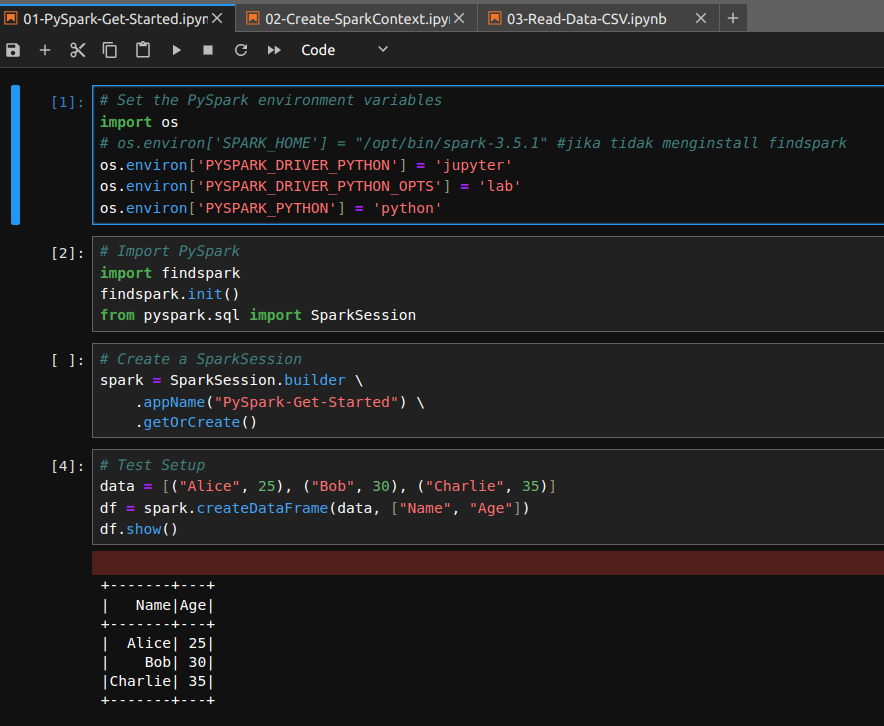

# Setup Proyek PySpark di Ubuntu


## Table of Contents
- [Deskripsi Proyek](#deskripsi-proyek)
- [Requirement](#requirement)
- [Langkah 1: Instalasi Java Development Kit (JDK)](#langkah-1-instalasi-java-development-kit-jdk)
- [Langkah 2: Instalasi Apache Spark](#langkah-2-instalasi-apache-spark)
- [Langkah 3: Konfigurasi Lingkungan](#langkah-3-konfigurasi-lingkungan)
- [Langkah 4: Instalasi PySpark](#langkah-4-instalasi-pyspark)

## Deskripsi Proyek
Repository ini bertujuan untuk menunjukkan langkah-langkah dalam menyiapkan proyek menggunakan Apache Spark dengan menggunakan PySpark di lingkungan Ubuntu.

## Requirement
- Java Development Kit (JDK)
- Python 3 dan pip
- Koneksi internet untuk mengunduh Apache Spark

## Langkah 1: Instalasi Java Development Kit (JDK)
1. Pastikan bahwa JDK sudah diinstal dengan menjalankan perintah berikut di terminal:

    ```bash
    java -version
    ```

2. Jika belum diinstal, instal OpenJDK dengan perintah berikut:

    ```bash
    sudo apt update
    sudo apt install default-jdk


## Langkah 2: Instalasi Apache Spark

1. Unduh Apache Spark dari situs web resminya dengan perintah berikut di terminal:

    ```bash
    wget https://apache.claz.org/spark/spark-3.2.0/spark-3.2.0-bin-hadoop3.2.tgz
    ```
2. Ekstrak arsip unduhan dengan perintah berikut:

    ```bash
    tar -xvzf spark-3.2.0-bin-hadoop3.2.tgz
    ```
3. Pindahkan direktori hasil ekstraksi ke lokasi yang lebih permanen, misalnya `/opt`:

    ```bash
    sudo mv spark-3.2.0-bin-hadoop3.2 /opt/spark-3.2.0
    ```

## Langkah 3: Konfigurasi Lingkungan

1. Tambahkan direktori `bin` Spark ke dalam `PATH` lingkungan Anda dengan membuka berkas `.bashrc` dan menambahkan baris berikut:

    ```bash
    export SPARK_HOME=/opt/spark-3.2.0
    export PATH=$PATH:$SPARK_HOME/bin
    ```

## Langkah 4: Verifikasi Instalasi

### Persiapkan Lingkungan Virtual (Virtual Environment)

1. Pastikan Python dan pip sudah terinstal di lokal komputer. 

    ```bash
    python --version
    ```
    Jika belum, instal Python terlebih dahulu.

    ```bash
    sudo apt install python3 python3-pip
    ```

2. Buka terminal dan buat direktori baru:

   ```bash
   mkdir pyspark_project

   cd pyspark_project
   ```

3. Buat virtual environment dengan menggunakan venv atau virtualenv. Misalnya, untuk membuat virtual environment bernama env:

    ```bash
    python3 -m venv env
    ```

4. Aktifkan virtual environment:

    ```bash
    source env/bin/activate
    ```

5. Dalam lingkungan virtual yang diaktifkan, instal PySpark menggunakan pip:

    ```bash
    pip install pyspark
    ```

6. Instalasi Jupyter Notebook (Opsional) di dalam virtual environment yang sama:

    ```bash 
    pip install jupyter
    ```

7. Buka direktori project virtual environment menggunakan jupyter lab atau notebook:

    ```bash
    jupyter lab
    ```

8. Di antarmuka Jupyter Notebook, buat notebook baru dengan mengklik tombol "New" dan memilih Python 3 di bagian kanan atas. Kemudian verifikasi dengan menjalankan script di bawah ini adalah cell notebook:
